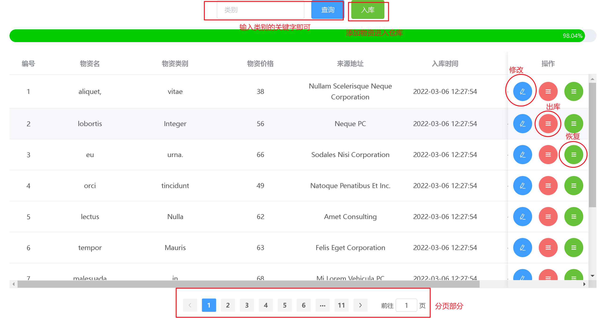

# 仓库管理系统设计流程

[TOC]

## 一、概述

仓库管理系统，即对企业物质资源进行调控与管理的系统，该系统针对出库、入库、库存进行监控，使用者可以将各物资录入数据库中，实时监控物资变动

## 二、需求分析

### 1.需求实体

**管理者**(编号，姓名，年龄，性别，住址，邮箱，手机号，账号编号)
**账号**(编号，账号，密码，冻结指数，创建时间，修改时间)
**物资**(编号，名称，类别，价格，入库时间，出库时间，来源地址)

### 2.执行流程


## 三、技术架构

### 前端

Vue+Axios+ElementUi

### 后端

SpringBoot+SpringMVC+MyBatis Plus+Druid

### 运行环境

jdk1.8
MySQL8.0

### 运行流程


## 四、数据库设计

### 表结构


### 脚本

```sql
-- 仓库管理系统
create database WareHouseSystem;

use WareHouseSystem;

-- 账号表
create table user(
	id int primary key auto_increment comment '编号',
	user_Name varchar(64) not null comment '用户名',
	user_passWord varchar(64) not null comment '用户密码',
	deleted int not null default 0 comment '冻结指数',
	create_Time datetime not null default CURRENT_TIMESTAMP comment '创建时间',
	update_Time datetime not null default CURRENT_TIMESTAMP comment '修改时间'
);

-- 管理员信息
create table administrator(
	id int primary key auto_increment comment '编号',
	admin_Name varchar(64) not null comment '管理者姓名',
	admin_Age varchar(64) not null comment '管理者年龄',
	admin_Sex varchar(8) not null comment '管理者性别',
	admin_Address varchar(128) not null comment '管理者住址',
	admin_Email varchar(64) not null comment '电子邮箱',
	admin_Phone varchar(64) not null comment '手机号',
	user_Id int comment '用户编号',
	constraint user_administrator_fk foreign key (user_Id) references user(id)
);

-- 物资信息
create table material(
	id int primary key auto_increment comment '编号',
	material_Name varchar(64) not null comment '物资名称',
	material_Category varchar(64) not null comment '物资类别',
	material_Price int not null comment '物资价格',
	in_Time datetime default CURRENT_TIMESTAMP not null comment '入库时间',
	out_Time datetime default CURRENT_TIMESTAMP not null comment '出库时间',
	material_Address varchar(64) not null comment '来源地址',
        material_Status int not null default 0 commit '物资状态'
);
```

## 五、后端开发

### 项目结构

> 整体
> 

> 配置文件

```yml
#端口号
server:
  port: 8080

#druid数据源配置
spring:
  datasource:
    druid:
      url: jdbc:mysql://localhost:3306/warehousesystem?useSSL=true&serverTimezone=GMT&characterEncoding=utf8
      username: root
      password: 13597803422dw
      driver-class-name: com.mysql.cj.jdbc.Driver

#开启mybatis plus日志
mybatis-plus:
  configuration:
    log-impl: org.apache.ibatis.logging.stdout.StdOutImpl
  #开启逻辑删除
  global-config:
    db-config:
      logic-delete-value: 1 # 逻辑已删除值(默认为 1)
      logic-not-delete-value: 0 # 逻辑未删除值(默认为 0)
```

## 六、前端开发

### 效果图

> 登录
> 

> 主页
> 

> 作者:春风能解释
> 时间:2022/3/9
