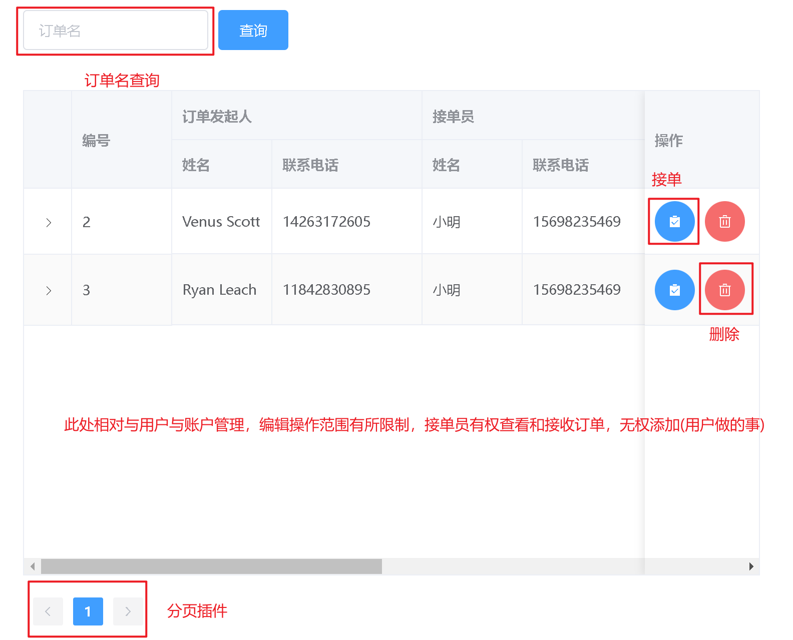

# 大学外卖跑腿设计流程

## 一、概述

大学外卖跑腿系统，即为帮助同学们拿取外卖、快递、食堂带饭的处理业务的系统，该系统可以处理主办方繁杂的业务需求，包括订单管理、分配跑腿业务、反馈用户、用户管理等。

## 二、业务

### 1.主要需求

快递、外卖代拿，用户管理，跑腿员管理，订单管理，账号管理

### 2.具体业务执行流程

首先，由用户发起订单，管理员负责接收，并传达给各个跑腿员，跑腿员根据的订单要求去执行相应的业务，待业务执行完成以后，跑腿员将订单执行结果反馈给管理员，管理员汇总后再负责将解果反馈给用户。

具体流程如下：


> 业务流程概括即:发起=>分配=>完成=>汇总=>反馈

### 3.技术需求

该系统主要以 SpringBoot 为后端，Vue 为前端，前后端分离

### 4.程序执行流程


### 5.运行环境

#### 所需环境

后端:**SpringBoot+MyBatis Plus+Druid+SpringMVC**
前端:**Vue+Axios+ElementUi+BootStrap**

#### 后端依赖

jdk1.8

MySQL8.0+

#### 前端依赖

vue 3.0+

## 三、后端

### 1.数据层

#### a.实体分析

1. **账号表**(编号，账号，密码，账号状态(**0 为已冻结，1 为未冻结**)，创建时间，最后更新时间)
2. **用户表**(编号，姓名，年龄，性别，联系方式，家庭住址，用户职务(**0 普通用户，1 接单员，2 跑腿员**)，账号编号)
3. **订单表**(编号，订单信息，发起时间，修改时间，发起人编号，接单员编号，跑腿员编号，支付价格，支付状态(**0 为未支付，1 为已支付**))

#### b.实现

> 表结构
> 

> 脚本

```sql
-- 校园跑腿
create database takeawaysystem;

use takeawaysystem;

-- 账号表
create table account
(
    account_id          int primary key auto_increment comment '用户编号',
    account_name        varchar(32) not null comment '用户名(账号)',
    account_password    varchar(32) not null comment '用户密码',
    account_deleted     varchar(1)  not null default 0 comment '冻结指数',
    account_create_time datetime    not null default CURRENT_TIMESTAMP comment '创建时间',
    account_update_time datetime    not null default CURRENT_TIMESTAMP ON UPDATE CURRENT_TIMESTAMP comment '最后更新时间'
);

-- 用户表
create table user
(
    user_id       int primary key auto_increment comment '用户编号',
    user_name     varchar(32) not null comment '用户姓名',
    user_age      int         not null comment '用户年龄',
    user_sex      varchar(4)  not null comment '用户性别',
    user_address  varchar(64) not null comment '用户住址',
    user_phone varchar(11) not null comment '手机号',
    user_duty     int         not null default 0 comment '用户职务(0 普通用户，1 接单员，2 跑腿员)',
    account_id    int         not null comment '账号编号',
    constraint user_account_fk foreign key (account_id) references account (account_id)
);

-- 订单表
create table `order`
(
    order_id          int primary key auto_increment comment '订单编号',
    order_name        varchar(1024) not null comment '订单信息',
    user_id           int           not null comment '发起人编号',
    admin_id          int comment '接单员编号',
    run_id            int comment '跑腿员编号',
    order_create_time datetime      not null default CURRENT_TIMESTAMP comment '创建时间',
    order_update_time datetime      not null default CURRENT_TIMESTAMP ON UPDATE CURRENT_TIMESTAMP comment '最后更新时间',
    constraint user_order_fk foreign key (user_id) references user (user_id),
    constraint admin_order_fk foreign key (admin_id) references user (user_id),
    constraint run_account_fk foreign key (run_id) references user (user_id)
);

```

### 2.连接池

> 本项目采用 druid 连接池(支持国产!)

配置信息如下:

```yml
#web服务端口
server:
  port: 8080

#druid连接池
spring:
  datasource:
    druid:
      driver-class-name: com.mysql.cj.jdbc.Driver
      url: jdbc:mysql://localhost:3306/takeawaysystem?userSSL=true&serverTimezone=GMT
      username: root
      password: 13597803422dw

#逻辑删除
mybatis-plus:
  global-config:
    db-config:
      logic-delete-field: flag # 全局逻辑删除的实体字段名(since 3.3.0,配置后可以忽略不配置步骤2)
      logic-delete-value: 1 # 逻辑已删除值(默认为 1)
      logic-not-delete-value: 0 # 逻辑未删除值(默认为 0)
#  #开启日志
#  configuration:
#    log-impl: org.apache.ibatis.logging.stdout.StdOutImpl
```

### 3.逻辑层

_整体采用 MVC 架构_

#### 项目结构


#### 核心业务代码

1. 账号管理

```java
    /**
     * 账号数据层
     */
    @Autowired
    private AccountMapper accountMapper;

    /**
     * 运行状态
     */
    private Boolean status;

    /**
     * 数据
     */
    private Object data;

    /**
     * 查询总数
     */
    private Long pageSize;
    /**
     * 永久删除账号(注销)
     *
     * @param account 需提供:用户编号
     * @return 影响行数
     */
    @Override
    public Json deleteByAccountId(Account account) {
        try {
            data = accountMapper.deleteByAccountId(account) > 0;
            status = true;
        } catch (Exception e) {
            status = false;
            e.printStackTrace();
        }
        return new Json(status, data, null);
    }

    /**
     * 查询所有账号(包含已注销用户)
     *
     * @param current 页码
     * @param size    每页显示数
     * @return page
     */
    @Override
    public Json selectAllAccount(int current, int size) {
        try {
            Page<Account> accountPage = accountMapper.selectAllAccount(new Page<>(current, size));
            data = accountPage.getRecords();
            pageSize = accountPage.getTotal();
            status = true;
        } catch (Exception e) {
            status = false;
            e.printStackTrace();
        }
        return new Json(status, data, pageSize);
    }

    /**
     * 条件查询用户(包含已注销的用户)
     *
     * @param current     页码
     * @param size        每页显示数
     * @param accountName 账号
     * @return Account
     */
    @Override
    public Json selectAccountWrapper(int current, int size, String accountName) {
        try {
            Page<Account> accountPage = accountMapper.selectAccountWrapper(new Page<>(current, size), new QueryWrapper<Account>().like("account_Name", accountName));
            data = accountPage.getRecords();
            pageSize = accountPage.getTotal();
            status = true;
        } catch (Exception e) {
            status = false;
            e.printStackTrace();
        }
        return new Json(status, data, pageSize);
    }

    /**
     * 添加账号
     *
     * @param account 需提供:账号,密码
     * @return Json
     */
    @Override
    public Json insertAccount(Account account) {
        try {
            data = accountMapper.insert(account) > 0;
            status = true;
        } catch (Exception e) {
            status = false;
            e.printStackTrace();
        }
        return new Json(status, data, null);
    }

    /**
     * 修改账号
     *
     * @param account 需提供:账号编号,可提供:账号,密码
     * @return Json
     */
    @Override
    public Json updateAccountById(Account account) {
        try {
            data = accountMapper.updateById(account) > 0;
            status = true;
        } catch (Exception e) {
            status = false;
            e.printStackTrace();
        }
        return new Json(status, data, null);
    }

    /**
     * 冻结账号
     *
     * @param account 需提供:账号编号
     * @return Json
     */
    @Override
    public Json freezeAccountById(Account account) {
        try {
            data = accountMapper.deleteById(account.getAccountId()) > 0;
            status = true;
        } catch (Exception e) {
            status = false;
            e.printStackTrace();
        }
        return new Json(status, data, null);
    }

    /**
     * 解冻账号
     *
     * @param account 需提供:账号编号
     * @return Json
     */
    @Override
    public Json unfreezeAccountById(Account account) {
        try {
            data = accountMapper.updateAccountDeleted(account) > 0;
            status = true;
        } catch (Exception e) {
            status = false;
            e.printStackTrace();
        }
        return new Json(status, data, null);
    }

    /**
     * 登录
     *
     * @param account 需提供:账号,密码
     * @return Json
     */
    @Override
    public Json login(Account account) {
        try {
            Account accountObject = accountMapper.selectOne(new QueryWrapper<Account>().eq("account_Name", account.getAccountName()).eq("account_Password", account.getAccountPassword()));
            if (accountObject != null) {
                account.setToken(JwtToken.createToken(accountObject));//验证成功则返回token
            }
            data = account;
            status = true;
        } catch (Exception e) {
            status = false;
            e.printStackTrace();
        }
        return new Json(status, data, null);
    }
```

2. 账单管理

```java
    /**
     * 订单业务层
     */
    @Autowired
    private OrderMapper orderMapper;

    /**
     * 用户编号
     */
    @Autowired
    private UserMapper userMapper;

    /**
     * 运行状态
     */
    private Boolean status;

    /**
     * 数据
     */
    private Object data;

    /**
     * 查询总数
     */
    private Long pageSize;

    /**
     * 查询所有订单
     *
     * @param current 页码
     * @param size    每页显示数
     * @return Json
     */
    @Override
    public Json selectAllOrder(int current, int size) {
        try {
            Page<Order> orderPage = orderMapper.selectPage(new Page<>(current, size), null);
            getUserName(orderPage);
        } catch (Exception e) {
            status = false;
            e.printStackTrace();
        }
        return new Json(status, data, pageSize);
    }

    /**
     * 模糊查询订单
     *
     * @param current   页码
     * @param size      每页显示数
     * @param orderName 订单名
     * @return Json
     */
    @Override
    public Json selectLikeOrder(int current, int size, String orderName) {
        try {
            Page<Order> orderPage = orderMapper.selectPage(new Page<>(current, size), new QueryWrapper<Order>().like("order_Name", orderName));
            getUserName(orderPage);
        } catch (Exception e) {
            status = false;
            e.printStackTrace();
        }
        return new Json(status, data, pageSize);
    }

    /**
     * 根据跑腿员编号查询订单
     *
     * @param current 页码
     * @param size    每页显示数
     * @param runId   跑腿员编号
     * @return Json
     */
    @Override
    public Json selectAllByRunId(int current, int size, Long runId) {
        try {
            Page<Order> orderPage = orderMapper.selectPage(new Page<>(current, size), new QueryWrapper<Order>().eq("run_id", runId));
            getUserName(orderPage);
        } catch (Exception e) {
            status = false;
            e.printStackTrace();
        }
        return new Json(status, data, pageSize);
    }

    /**
     * 根据客户编号查询订单
     *
     * @param current 页码
     * @param size    每页显示数
     * @param userId  用户编号
     * @return Json
     */
    @Override
    public Json selectAllUserId(int current, int size, Long userId) {
        try {
            Page<Order> orderPage = orderMapper.selectPage(new Page<>(current, size), new QueryWrapper<Order>().eq("user_id", userId));
            getUserName(orderPage);
        } catch (Exception e) {
            status = false;
            e.printStackTrace();
        }
        return new Json(status, data, pageSize);
    }

    /**
     * 添加订单
     *
     * @param order 需提供:订单名,发起人编号;可提供:管理员(接单员)编号,跑腿员编号
     * @return Json
     */
    @Override
    public Json insertOrder(Order order) {
        try {
            data = orderMapper.insert(order) > 0;
            status = true;
        } catch (Exception e) {
            status = false;
            e.printStackTrace();
        }
        return new Json(status, data, null);
    }

    /**
     * 修改订单
     *
     * @param order 需提供:订单编号;可提供:订单名,管理员(接单员)编号,跑腿员编号,发起人编号
     * @return Json
     */
    @Override
    public Json updateOrderById(Order order) {
        try {
            data = orderMapper.updateById(order);
            status = true;
        } catch (Exception e) {
            status = false;
            e.printStackTrace();
        }
        return new Json(status, data, null);
    }

    /**
     * 删除订单
     *
     * @param order 需提供:订单编号
     * @return Json
     */
    @Override
    public Json deleteOrderById(Order order) {
        try {
            data = orderMapper.deleteById(order.getOrderId()) > 0;
            status = true;
        } catch (Exception e) {
            status = false;
            e.printStackTrace();
        }
        return new Json(status, data, null);
    }

    /**
     * 以编号获取名称
     *
     * @param orderPage 分页类
     */
    private void getUserName(Page<Order> orderPage) {
        List<Order> records = orderPage.getRecords();
        for (Order record : records) {
            if (record.getUserId() != null) {//获取发起人
                record.setUser(userMapper.selectById(record.getUserId()));
            }
            if (record.getAdminId() != null) {//获取接单员
                record.setAdmin(userMapper.selectById(record.getAdminId()));
            }
            if (record.getRunId() != null) {//获取跑腿员
                record.setRun(userMapper.selectById(record.getRunId()));
            }
        }
        data = records;
        pageSize = orderPage.getTotal();
        status = true;
    }
```

3. 用户管理

```java
    /**
     * 用户数据层
     */
    @Autowired
    private UserMapper userMapper;

    /**
     * 账号数据层
     */
    @Autowired
    private AccountMapper accountMapper;

    /**
     * 运行状态
     */
    private Boolean status;

    /**
     * 数据
     */
    private Object data;

    /**
     * 查询总数
     */
    private Long pageSize;

    /**
     * 查询所有用户
     *
     * @param current 页码
     * @param size    每页显示数
     * @return Json
     */
    @Override
    public Json selectAllUser(int current, int size) {
        try {
            Page<User> userPage = userMapper.selectPage(new Page<>(current, size), null);
            data = userPage.getRecords();
            pageSize = userPage.getTotal();
            status = true;
        } catch (Exception e) {
            status = false;
            e.printStackTrace();
        }
        return new Json(status, data, pageSize);
    }

    /**
     * 按照职务查询用户
     *
     * @param current 页码
     * @param size    每页显示数
     * @param duty    职务
     * @return Json
     */
    @Override
    public Json selectAllUserByDuty(int current, int size, String duty) {
        try {
            Page<User> userPage = userMapper.selectPage(new Page<>(current, size), new QueryWrapper<User>().eq("user_duty", duty));
            data = userPage.getRecords();
            pageSize = userPage.getTotal();
            status = true;
        } catch (Exception e) {
            status = false;
            e.printStackTrace();
        }
        return new Json(status, data, pageSize);
    }

    /**
     * 添加用户信息
     *
     * @param user 需提供:姓名,年龄,性别,住址,电话号码,用户编号
     * @return Json
     */
    @Override
    public Json insertUser(User user) {
        try {
            data = userMapper.insert(user) > 0;
            status = true;
        } catch (Exception e) {
            status = false;
            e.printStackTrace();
        }
        return new Json(status, data, null);
    }

    /**
     * 删除用户信息
     *
     * @param user 用户信息
     * @return Json
     */
    @Override
    public Json deleteUser(User user) {
        try {
            Account account = new Account();
            account.setAccountId(user.getAccountId());
            if (accountMapper.selectAccountWrapper(null, new QueryWrapper<Account>().eq("account_id", user.getUserId())).getRecords().size() > 0) {//判断用户是否存在
                data = accountMapper.deleteByAccountId(account) > 0;//删除账号
            }
            data = userMapper.deleteById(user.getUserId()) > 0;//删除用户
            status = true;
        } catch (Exception e) {
            status = false;
            e.printStackTrace();
        }
        return new Json(status, data, null);
    }

    /**
     * 修改用户信息
     *
     * @param user 需提供:用户编号,可提供:姓名,年龄,性别,住址,电话号码,用户编号
     * @return Json
     */
    @Override
    public Json updateUser(User user) {
        try {
            data = userMapper.updateById(user) > 0;
            status = true;
        } catch (Exception e) {
            status = false;
            e.printStackTrace();
        }
        return new Json(status, data, null);
    }
```

4. 登录拦截器

```java
/**
 * 登录拦截器
 */
public class LoginInterceptor implements HandlerInterceptor {
    @Override
    public boolean preHandle(HttpServletRequest request, HttpServletResponse response, Object handler) throws Exception {
        String token = request.getHeader("token");//获取前台传回来的token
        System.out.println(token);
        if (token != null) {
            return JwtToken.checkToken(token);
        } else {//不存在则证明用户未登录
            return false;
        }
    }
}
```

5. 配置

```java
@Configuration
public class InterceptorConfig implements WebMvcConfigurer {
    @Override
    public void addInterceptors(InterceptorRegistry registry) {
        registry.addInterceptor(new LoginInterceptor())
                .addPathPatterns("/**")
                .excludePathPatterns(
                        "/account/login",//登录
                        "/account/register",//注册
                        "/**/*.html",       //html静态资源
                        "/**/*.js",         //js静态资源
                        "/**/*.css",        //css静态资源
                        "/**/*.img",
                        "/**/*.ttf");
    }
}
```

> 用户登录后，token 会保留 30 分钟，用户每次访问被保护的资源时，都会在请求头添加 token，后台进行验证

## 4.前端

_前端将三种身份分离，各做各事，避免数据重复_

### 1.管理员端(adminport)

**管理员端采用 pc 端设计，具有管理用户和接单分配任务的功能**

> 登录界面
> 

> 整体
> 

> 账号管理
> 

> 用户管理
> 

> 订单管理
> 

> 登录账号设置
> 

### 2.跑腿端(runport)

**跑腿员端采用移动端设计模式，支持手机和部分平板的显示**

> 登录界面
> 

> 查看订单
> 
> 此页面数据来自用户登录的数据，即订单中包含该跑腿员的数据

### 3.用户端(userport)

**用户端基于 Android 开发**

#### 界面

> 登录界面
> 

> 操作界面 2
> 

> 添加
> 

> 修改
> 

> 删除
> 

#### 核心代码

> http 核心请求类

```java
/**
     * 公共地址
     */
    private static final String requestUrl = "http://192.168.1.127:8080";


    /**
     * 响应流
     */
    private static Json json;

    /**
     * 发送http请求
     *
     * @param method 请求方式
     * @param body   请求流
     * @param url    请求地址
     * @return String
     */
    public static Json header(String method, String body, String url, String token) {
        Thread thread = new Thread(() -> {
            try {
                OkHttpClient okHttpClient = new OkHttpClient();
                Request request;
                RequestBody requestBody = null;
                if (!method.equals("GET")) {
                    requestBody = RequestBody.create(MediaType.parse("application/json"), body);//创建请求流
                }
                if (method.equals("GET") & token != null) {//其他业务
                    request = new Request.Builder()
                            .url(requestUrl + url)
                            .header("token", token)
                            .get()
                            .build();//创建http请求

                } else if (token == null) {//token可以不需要时
                    request = new Request.Builder()
                            .url(requestUrl + url)
                            .method(method, requestBody)
                            .build();//创建http请求
                } else {//发送get请求
                    request = new Request.Builder()
                            .url(requestUrl + url)
                            .header("token", token)
                            .method(method, requestBody)
                            .build();//创建http请求
                }
                Response response = okHttpClient.newCall(request).execute();//发送http请求
                json = JsonUtil.getObject(response.body().string());
            } catch (Exception e) {
                e.printStackTrace();
            }
        });
        thread.start();
        //判断线程是否结束
        while (true) {
            if (thread.isAlive()) {
                try {
                    thread.join(100);
                } catch (InterruptedException e) {
                    e.printStackTrace();
                }
            } else {
                break;
            }
        }
        return json;
    }
```

> 业务层

```java
 /**
     * 查询当前所有订单
     *
     * @param current 页码
     * @param size    每页显示数
     * @param token   token字符串
     * @return Json
     */
    @Override
    public Json selectAllOrder(int current, int size, int userId, String token) {
        return HttpServiceImpl.header("GET", null, "/order/" + current + "/" + size + "/" + userId + "?user", token);
    }

    /**
     * 用户添加订单
     *
     * @param order 需提供:订单名,发起人编号;可提供:管理员(接单员)编号,跑腿员编号
     * @param token token字符串
     * @return Json
     */
    @Override
    public Json addOrder(Order order, String token) {
        return HttpServiceImpl.header("POST", JsonUtil.getString(order), "/order", token);
    }

    /**
     * 用户修改订单
     *
     * @param order 需提供:订单编号;可提供:订单名,管理员(接单员)编号,跑腿员编号,发起人编号
     * @param token token字符串
     * @return Json
     */
    @Override
    public Json updateOrder(Order order, String token) {
        return HttpServiceImpl.header("PUT", JsonUtil.getString(order), "/order", token);
    }

    /**
     * 用户删除订单
     *
     * @param order 需提供:订单编号
     * @param token token字符串
     * @return Json
     */
    @Override
    public Json deleteOrder(Order order, String token) {
        return HttpServiceImpl.header("DELETE", JsonUtil.getString(order), "/order", token);
    }

    /**
     * 登录
     *
     * @param account 需提供:账号,密码
     * @return Json
     */
    @Override
    public Json login(Account account) {

        return HttpServiceImpl.header("POST", JsonUtil.getString(account), "/account/login", null);
    }
```

> token 解析

```java
/**
     * 解析token
     *
     * @param token token字符
     */
    public static void getToken(String token) {
        TokenUtil.token = token;
        try {
            DecodedJWT decode = JWT.decode(token);
            account = decode.getClaim("user").as(Account.class);
        } catch (Exception e) {
            e.printStackTrace();
        }
    }
```

**作者:春风能解释**
时间:**2022/3/24**
