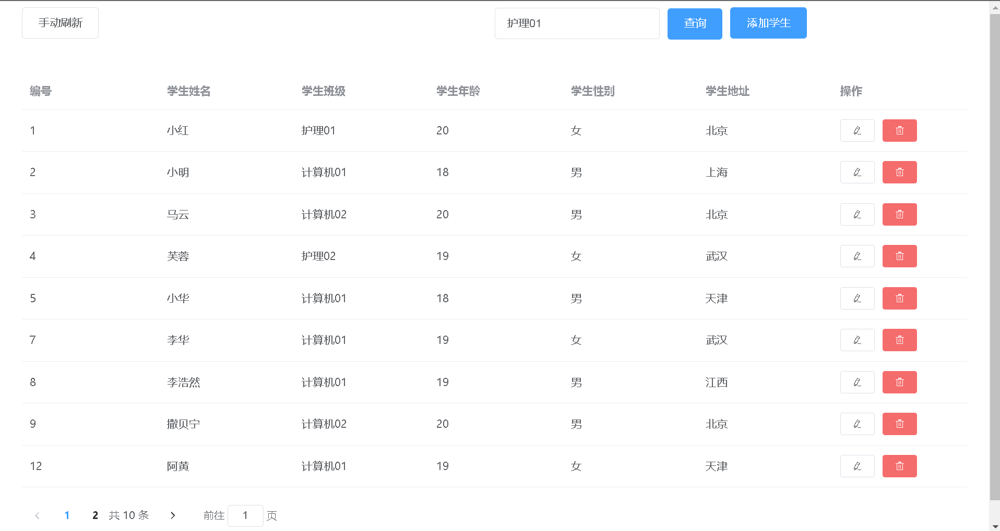
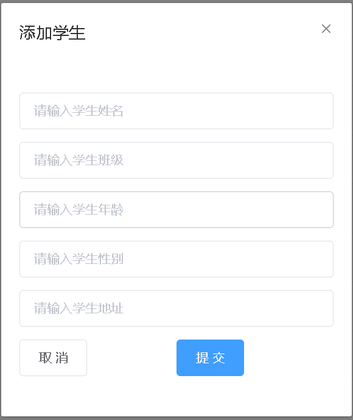
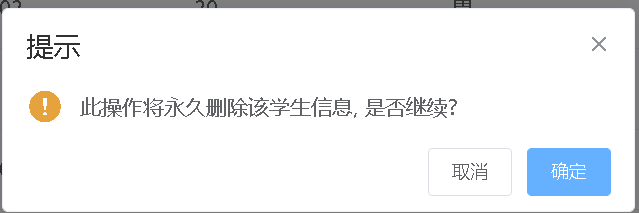
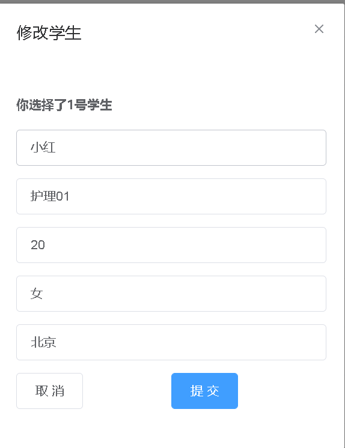
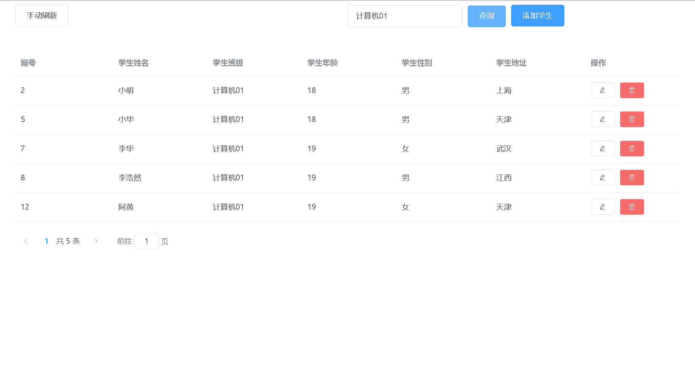
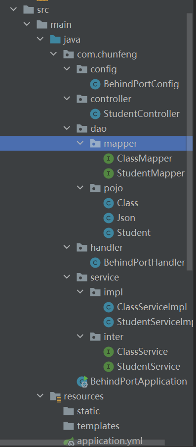

# 学生管理系统设计总结

## 一、概述

学生管理系统，是一个管理学生信息的系统，它采用springboot+vue的设计架构，拥有增删改查学生信息的功能，为管理学生信息提供了一个便捷的方式。

## 二、整体架构

前后端完全分离

前端：Vue+Element UI+Axios

后端：SpringBoot+MyBatis plus+SpringMVC

## 三、环境依赖

java：jdk1.8

数据库：mysql8.0

Vue：vue/cli 4.5.15

## 四、功能实现

### 前端：

整体界面：

该界面支持分页操作

增加：

删除：

修改：

按班级号查找： JAVA_HOME=/usr/lib/jvm/jre-1.6.0-openjdk.x86_64 PATH=$PATH:$JAVA_HOME/bin CLASSPATH=.:$JAVA_HOME/lib/dt.jar:
$JAVA_HOME/lib/tools.jar export JAVA_HOME CLASSPATH PATH

### 后端：

结构如下：

## 已知的未修复的bug

1.查询的班级名称如果数据库中没有该班级，则修改和添加弹窗会暂时无法显示，此时，点击手动刷新按钮即可解决此问题

2.修改学生时，查询框中会显示当前修改的学生班级，如果修改修改框中的值，则该学生的班级名会显示对应的值，这个按常操作即可，数据库中的值并不会改变

项目我已发布在git上，欢迎大家下载练习和提出建议

git地址：

[学生管理系统(基于Springboot+Vue架构)](https://gitee.com/cfnjs/web/tree/master/学生管理系统(基于Springboot+Vue架构))

**作者：春风能解释(git：梦途)**
**时间：2022年2月1日**
