[toc]

# 教务管理系统设计总结

## 一、概述

教务管理系统，是一个管理教师、学生信息和管理教师、学生事务的管理系统，该系统分为教师端、学生端和管理员端，其权限比较：管理员>教师>学生，管理员负责管理教师、学生、账号各信息，教师负责向学生端发布作业信息和批改学生作业，学生端接受作业后将作业提交至教师端，三者中管理员权限最大也最辛苦，可由教师账号和学生账号选举产生，由管理员授权

## 二、项目结构及执行流程

### 1.执行流程

#### 技术架构

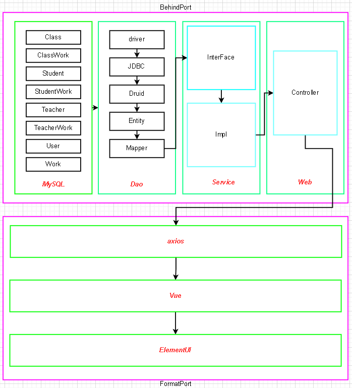

#### 学生端

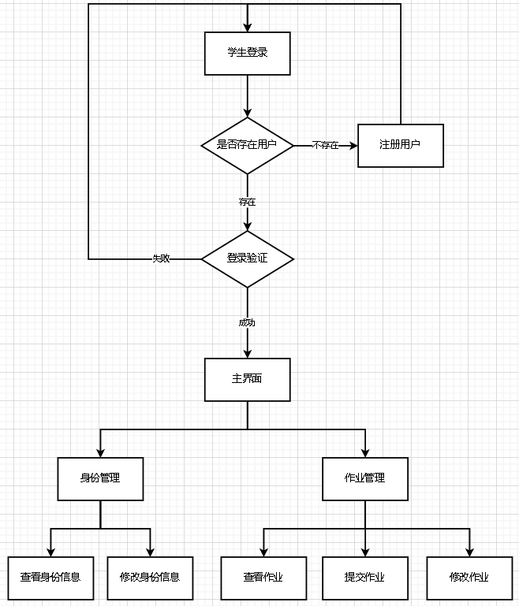

#### 教师端

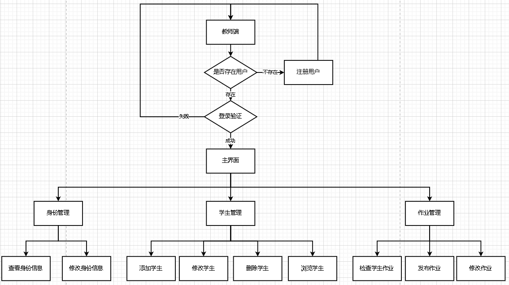

#### 管理员

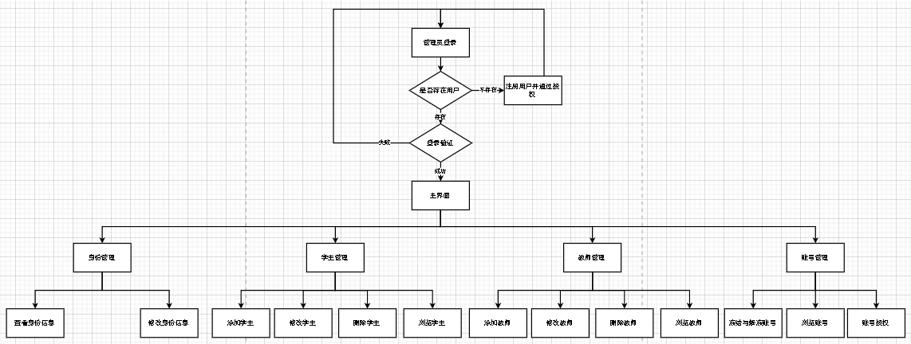

### 2.项目结构

以 maven 为容器，SpringBoot+Vue 架构，前后端分离

#### 后端

SpringBoot+MyBatis Plus+SpringMVC

#### 前端

Vue+Axios+Element UI

#### 开发环境

jdk1.8

MySQL8.0.20

Vue @vue/cli 4.5.15

## 三、数据库

### 表结构

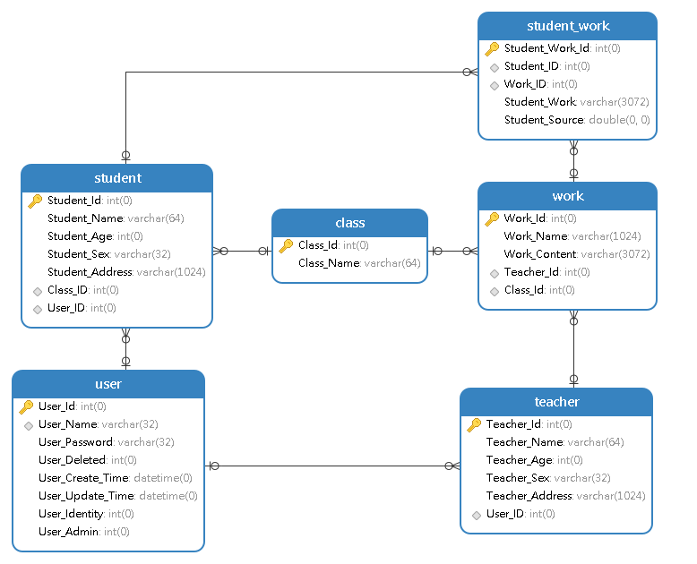

### 脚本

```SQL
-- 教务管理系统
CREATE DATABASE studentworksystem;

USE studentworksystem;

-- ----------------------------
-- Table structure for class
-- ----------------------------
DROP TABLE IF EXISTS `class`;
CREATE TABLE `class`
(
    `Class_Id`   int(0)                                                       NOT NULL AUTO_INCREMENT COMMENT '班级编号',
    `Class_Name` varchar(64) CHARACTER SET utf8mb4 COLLATE utf8mb4_0900_ai_ci NOT NULL COMMENT '班级名称',
    PRIMARY KEY (`Class_Id`) USING BTREE
) ENGINE = InnoDB
  AUTO_INCREMENT = 11
  CHARACTER SET = utf8mb4
  COLLATE = utf8mb4_0900_ai_ci
  ROW_FORMAT = Dynamic;

-- ----------------------------
-- Table structure for student
-- ----------------------------
DROP TABLE IF EXISTS `student`;
CREATE TABLE `student`
(
    `Student_Id`      int(0)                                                         NOT NULL AUTO_INCREMENT COMMENT '编号',
    `Student_Name`    varchar(64) CHARACTER SET utf8mb4 COLLATE utf8mb4_0900_ai_ci   NOT NULL COMMENT '学生姓名',
    `Student_Age`     int(0)                                                         NOT NULL COMMENT '学生年龄',
    `Student_Sex`     varchar(32) CHARACTER SET utf8mb4 COLLATE utf8mb4_0900_ai_ci   NOT NULL COMMENT '学生性别',
    `Student_Address` varchar(1024) CHARACTER SET utf8mb4 COLLATE utf8mb4_0900_ai_ci NOT NULL COMMENT '学生居住地',
    `Class_ID`        int(0)                                                         NULL DEFAULT NULL COMMENT '班级编号',
    `User_ID`         int(0)                                                         NULL DEFAULT NULL COMMENT '用户编号',
    PRIMARY KEY (`Student_Id`) USING BTREE,
    INDEX `Student_Work_fk` (`Class_ID`) USING BTREE,
    INDEX `Student_User_fk` (`User_ID`) USING BTREE,
    CONSTRAINT `Student_User_fk` FOREIGN KEY (`User_ID`) REFERENCES `user` (`User_Id`) ON DELETE RESTRICT ON UPDATE CASCADE,
    CONSTRAINT `Student_Work_fk` FOREIGN KEY (`Class_ID`) REFERENCES `class` (`Class_Id`) ON DELETE RESTRICT ON UPDATE CASCADE
) ENGINE = InnoDB
  AUTO_INCREMENT = 204
  CHARACTER SET = utf8mb4
  COLLATE = utf8mb4_0900_ai_ci
  ROW_FORMAT = Dynamic;

-- ----------------------------
-- Table structure for student_work
-- ----------------------------
DROP TABLE IF EXISTS `student_work`;
CREATE TABLE `student_work`
(
    `Student_Work_Id` int(0)                                                         NOT NULL AUTO_INCREMENT COMMENT '编号',
    `Student_ID`      int(0)                                                         NULL DEFAULT NULL COMMENT '学生编号',
    `Work_ID`         int(0)                                                         NULL DEFAULT NULL COMMENT '作业编号',
    `Student_Work`    varchar(3072) CHARACTER SET utf8mb4 COLLATE utf8mb4_0900_ai_ci NULL DEFAULT NULL COMMENT '学生作业',
    `Student_Source`  double                                                         NULL DEFAULT 0 COMMENT '学生成绩',
    PRIMARY KEY (`Student_Work_Id`) USING BTREE,
    INDEX `Student_fk` (`Student_ID`) USING BTREE,
    INDEX `SWork_fk` (`Work_ID`) USING BTREE,
    CONSTRAINT `Student_fk` FOREIGN KEY (`Student_ID`) REFERENCES `student` (`Student_Id`) ON DELETE RESTRICT ON UPDATE CASCADE,
    CONSTRAINT `SWork_fk` FOREIGN KEY (`Work_ID`) REFERENCES `work` (`Work_Id`) ON DELETE RESTRICT ON UPDATE CASCADE
) ENGINE = InnoDB
  AUTO_INCREMENT = 235
  CHARACTER SET = utf8mb4
  COLLATE = utf8mb4_0900_ai_ci
  ROW_FORMAT = Dynamic;

-- ----------------------------
-- Table structure for teacher
-- ----------------------------
DROP TABLE IF EXISTS `teacher`;
CREATE TABLE `teacher`
(
    `Teacher_Id`      int(0)                                                         NOT NULL AUTO_INCREMENT COMMENT '编号',
    `Teacher_Name`    varchar(64) CHARACTER SET utf8mb4 COLLATE utf8mb4_0900_ai_ci   NOT NULL COMMENT '教师姓名',
    `Teacher_Age`     int(0)                                                         NOT NULL COMMENT '教师年龄',
    `Teacher_Sex`     varchar(32) CHARACTER SET utf8mb4 COLLATE utf8mb4_0900_ai_ci   NOT NULL COMMENT '教师性别',
    `Teacher_Address` varchar(1024) CHARACTER SET utf8mb4 COLLATE utf8mb4_0900_ai_ci NOT NULL COMMENT '教师居住地',
    `User_ID`         int(0)                                                         NULL DEFAULT NULL COMMENT '用户编号',
    PRIMARY KEY (`Teacher_Id`) USING BTREE,
    INDEX `Teacher_User_fk` (`User_ID`) USING BTREE,
    CONSTRAINT `Teacher_User_fk` FOREIGN KEY (`User_ID`) REFERENCES `user` (`User_Id`) ON DELETE RESTRICT ON UPDATE CASCADE
) ENGINE = InnoDB
  AUTO_INCREMENT = 53
  CHARACTER SET = utf8mb4
  COLLATE = utf8mb4_0900_ai_ci
  ROW_FORMAT = Dynamic;

-- ----------------------------
-- Table structure for user
-- ----------------------------
DROP TABLE IF EXISTS `user`;
CREATE TABLE `user`
(
    `User_Id`          int(0)                                                       NOT NULL AUTO_INCREMENT COMMENT '编号',
    `User_Name`        varchar(32) CHARACTER SET utf8mb4 COLLATE utf8mb4_0900_ai_ci NOT NULL COMMENT '用户姓名',
    `User_Password`    varchar(32) CHARACTER SET utf8mb4 COLLATE utf8mb4_0900_ai_ci NOT NULL COMMENT '用户密码',
    `User_Deleted`     int(0)                                                       NOT NULL DEFAULT 0 COMMENT '冻结指数',
    `User_Create_Time` datetime(0)                                                  NOT NULL DEFAULT CURRENT_TIMESTAMP(0) COMMENT '创建时间',
    `User_Update_Time` datetime(0)                                                  NOT NULL DEFAULT CURRENT_TIMESTAMP(0) ON UPDATE CURRENT_TIMESTAMP(0) COMMENT '修改时间',
    `User_Identity`    int(0)                                                       NOT NULL DEFAULT 0 COMMENT '身份码',
    `User_Admin`       int(0)                                                       NOT NULL DEFAULT 0 COMMENT '管理员码',
    PRIMARY KEY (`User_Id`) USING BTREE,
    UNIQUE INDEX `username` (`User_Name`) USING BTREE
) ENGINE = InnoDB
  AUTO_INCREMENT = 263
  CHARACTER SET = utf8mb4
  COLLATE = utf8mb4_0900_ai_ci
  ROW_FORMAT = Dynamic;

-- ----------------------------
-- Table structure for work
-- ----------------------------
DROP TABLE IF EXISTS `work`;
CREATE TABLE `work`
(
    `Work_Id`      int(0)                                                         NOT NULL AUTO_INCREMENT COMMENT '编号',
    `Work_Name`    varchar(1024) CHARACTER SET utf8mb4 COLLATE utf8mb4_0900_ai_ci NOT NULL COMMENT '作业姓名',
    `Work_Content` varchar(3072) CHARACTER SET utf8mb4 COLLATE utf8mb4_0900_ai_ci NULL DEFAULT NULL COMMENT '作业要求',
    `Teacher_Id`   int(0)                                                         NULL DEFAULT NULL COMMENT '教师编号',
    `Class_Id`     int(0)                                                         NULL DEFAULT NULL COMMENT '班级编号',
    PRIMARY KEY (`Work_Id`) USING BTREE,
    INDEX `Class_Work_fk` (`Class_Id`) USING BTREE,
    INDEX `Teacher_Work_fk` (`Teacher_Id`) USING BTREE,
    CONSTRAINT `Class_Work_fk` FOREIGN KEY (`Class_Id`) REFERENCES `class` (`Class_Id`) ON DELETE CASCADE ON UPDATE CASCADE,
    CONSTRAINT `Teacher_Work_fk` FOREIGN KEY (`Teacher_Id`) REFERENCES `teacher` (`Teacher_Id`) ON DELETE CASCADE ON UPDATE CASCADE
) ENGINE = InnoDB
  AUTO_INCREMENT = 71
  CHARACTER SET = utf8mb4
  COLLATE = utf8mb4_0900_ai_ci
  ROW_FORMAT = Dynamic;
```

## 四、后端开发

> 后端依托 springboot 这个大框架为主体，mybatis plus 作为数据层，springMVC 为表现层

### 1.核心结构

#### 数据层

> 以 mybatis plus 为框架

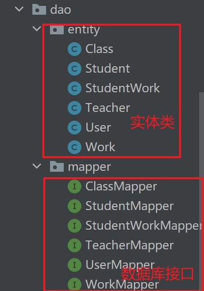

#### 业务层

> 直接与数据层交互

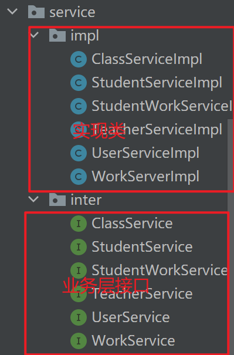

#### 表现层

> 与业务层交互

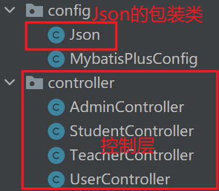

### 2.核心业务代码

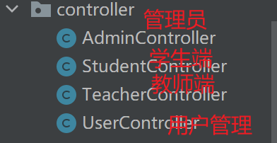

> 由于项目前后端分离，在这里用于与前端交互数据，前端向后端服务器发送各种请求，后端将返回 Json 用于响应

### 3.前端需发送的请求如下：

> 所有请求的前缀为 `http://[后端服务器地址]:[端口号]`，以下请求均以此向后添加字段即可

注意：由于响应的字符串为 Json 字符串，以下我将罗列响应和请求的 Json 各 key 值的含义，方便理解

> 以下为 java 实体类源码，其中 Json 以实体类定义的各对象属性字段为 key 值，带有`@TableId(type = IdType.AUTO)`为数据库主键，带有`@TableField(exist = false)`注解的代表数据库中没有该字段但实体类操作过程中必须的字段

```Java
//班级
@TableId(type = IdType.AUTO)
    private Long classId;//班级编号
    private String className;//班级名称
    @TableField(exist = false)
    private List<Work> classWorks;//班级作业

//学生
@TableId(type = IdType.AUTO)
    private Long studentId;//编号
    private String studentName;//学生姓名
    private Long classId;//班级编号
    private Long userId;//用户编号
    @TableField(exist = false)
    private String className;//班级名称
    private Integer studentAge;//学生年龄
    private String studentSex;//学生性别
    private String studentAddress;//学生地址
    @TableField(exist = false)
    private List<StudentWork> studentWorks;//学生作业

//学生作业
@TableId(type = IdType.AUTO)
    private Long studentWorkId;//学生作业编号
    private Long studentId;//学生编号
    private Long workId;//作业编号
    private String studentWork;//学生作业
    private Double studentSource;//作业分数
    @TableField(exist = false)
    private String studentName;//学生姓名

//教师
@TableId(type = IdType.AUTO)
    private Long teacherId;//编号
    private String teacherName;//教师姓名
    private int teacherAge;//教师年龄
    private String teacherSex;//教师性别
    private String teacherAddress;//教师地址
    private Long userId;//用户编号

//用户
@TableId(type = IdType.AUTO)
    private Long userId;//编号
    private String userName;//用户名
    @TableField(exist = false)
    private String newUserName;//新用户名
    private String userPassword;//用户密码
    @TableField(exist = false)
    private String newUserPassWord;//新密码
    @TableLogic
    private Integer userDeleted;//冻结指数
    @TableField(fill = FieldFill.INSERT)
    private Date userCreateTime;//创建时间
    @TableField(fill = FieldFill.INSERT_UPDATE)
    private Date userUpdateTime;//修改时间
    private Integer userIdentity;//用户身份
    private Integer userAdmin;//管理员标识
    @TableField(exist = false)
    private String userRealName;//用户真实姓名
    @TableField(exist = false)
    private String className;//用户班级
    @TableField(exist = false)
    private String address;//用户地址
    @TableField(exist = false)
    private String Identity;//身份
    @TableField(exist = false)
    private String Admin;//权限

//作业
@TableId(type = IdType.AUTO)
    private Long workId;//作业编号
    private String workName;//作业名称
    private String workContent;//作业要求
    private Long teacherId;//教师编号
    private Long classId;//班级编号
    @TableField(exist = false)
    private String teacherName;//布置人
    @TableField(exist = false)
    private String className;//班级名

//Json
private boolean status;//状态信息
private Object data;//数据
```

## 五、前端开发

### 1.核心结构


### 2.登录及注册界面

> 登录功能
> 

> 注册功能
> 

> 登录验证功能
> 

### 2.教师端

#### 核心代码

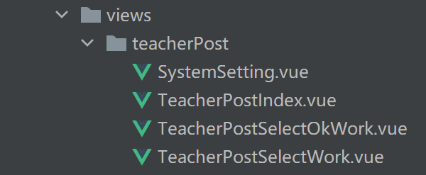

#### 核心效果

1. 查看功能
   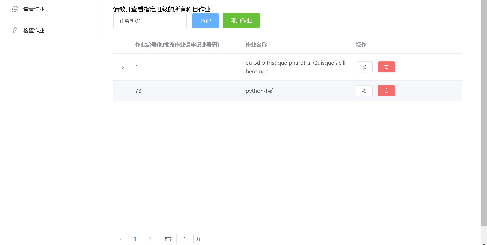
   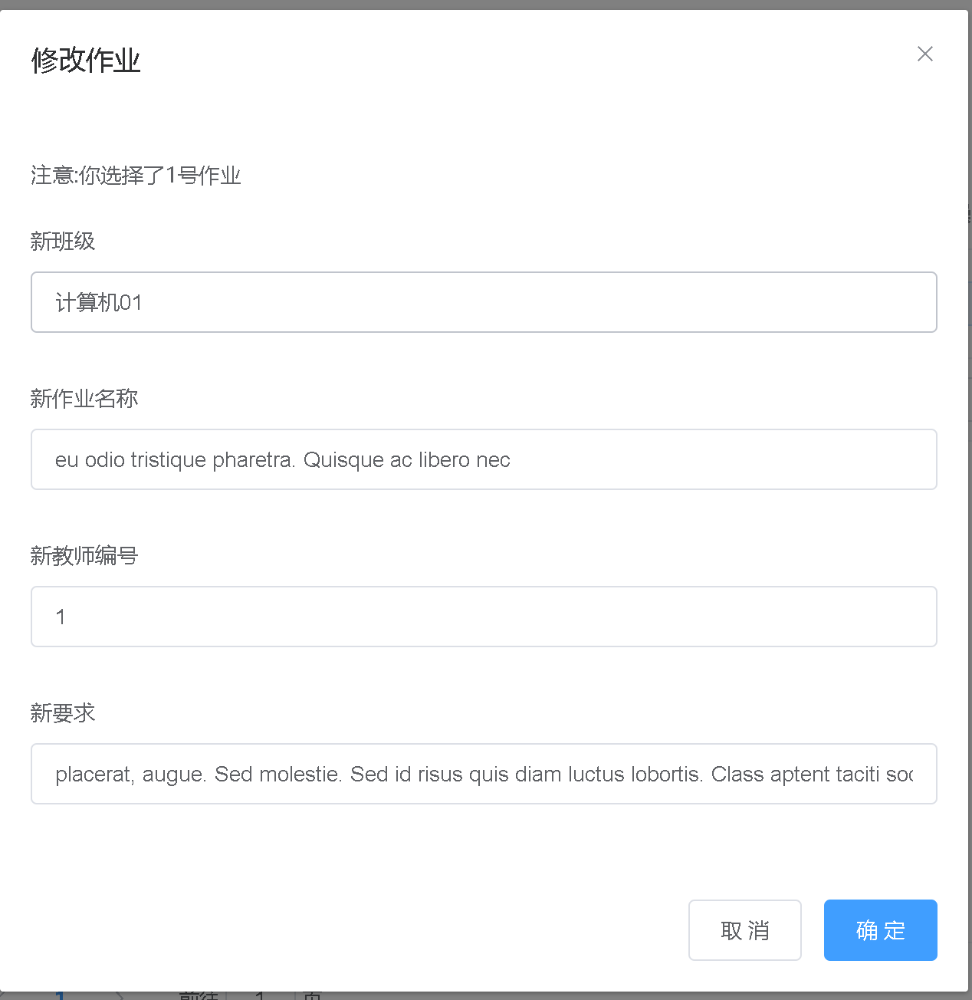
   

   > 在此板块中，教师用于查看一个班级布置的所有作业，可以向一个班级发布一次作业，修改作业，甚至删除作业(此功能需谨慎使用！)

2. 批改功能
   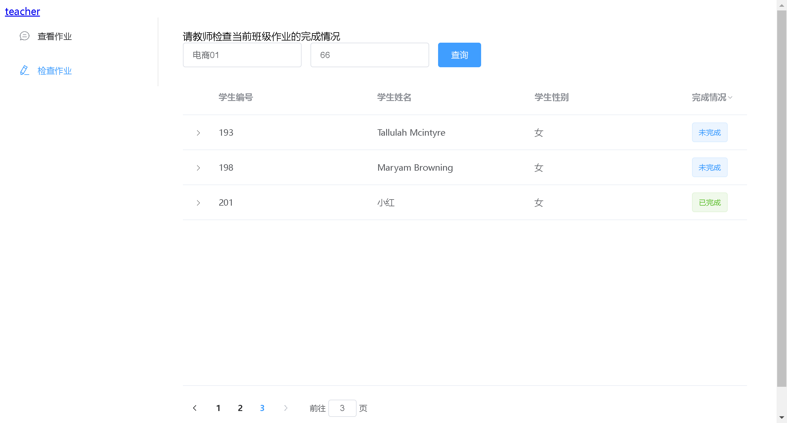
   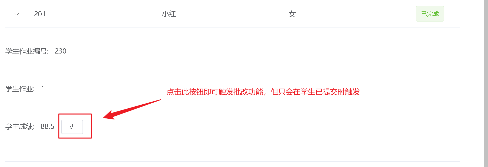
   > 在此板块中，教师主要用于直观的查看班级作业提交情况，下拉列表设有分数系统，教师可根据作业以及学生的完成情况进行人性化的处理

### 3.学生端

#### 核心代码


1. 整体界面
   

2. 查看作业
   

3. 查看班级作业
   

### 4.管理端

#### 核心代码


1. 管理学生
   

2. 管理教师
   

3. 管理用户
   

### 5.账号管理

> 这个页面为三个端口公共的部分
> 

已知的未修复的 bug 及临时解决方案:

1. 登录页面时，如果密码输入错误，输入框会进入"禁止"状态，此时点击浏览器刷新即可解决

2. 由于本人能力有限，登录界面暂未实现拦截和会话保存，用户登录时点击刷新后页面会失效，此时重新登录即可继续操作。

项目启动时间：2022 年 2 月 1 日

项目完结时间：2022 年 2 月 26 日

作者：春风能解释

项目 git 地址：
https://gitee.com/cfnjs/web/tree/master/%E6%95%99%E5%8A%A1%E7%AE%A1%E7%90%86%E7%B3%BB%E7%BB%9F(%E5%9F%BA%E4%BA%8ESpring+Vue%E7%9A%84%E8%AE%BE%E8%AE%A1%E6%9E%B6%E6%9E%84)
